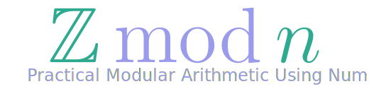

<div align="center">
  <a href="https://github.com/asanchezyali/zmodn#readme">
    
  </a>
</div>
<br>

# Zmodn: Practical Modular Arithmetic Using NumPy

The Zmodn package provides a class for representing elements in the ring of integers modulo n $(Z/nZ)$. It offers operations for modular arithmetic and matrix operations over this ring, making it useful for applications such as cryptography and computer algebra.

## Features

- Perform arithmetic operations (addition, subtraction, multiplication, division, exponentiation) on integers modulo a given positive integer.
- Compute the modular inverse of an integer modulo a given positive integer.
- Perform matrix operations, including matrix multiplication and inversion, modulo a given positive integer.
- Compare two integers modulo a given positive integer.
- Access and modify the representatives of an integer modulo a given positive integer.
- Efficient array operations using NumPy.
- Compatibility with NumPy functions through the `__array_function__` protocol.

## Installation

To install Zmodn, you can use pip:

```bash
pip install -e .
```

## Usage

Here's an overview of how to use the Zmodn class:

### Class Definition

```python
class Zmodn:
    def __init__(self, matrix_integers, module):
        # ...
```

The `Zmodn` class is initialized with two parameters:
- `matrix_integers`: A list of integers or a single integer representing the elements in Z/nZ.
- `module`: A positive integer representing the modulus.

### Basic Usage

1. Creating a Zmodn object:

```python
z = Zmodn([1, 2, 3], 5)
print(z)  # Output: [1 2 3] (mod 5)
```

2. Arithmetic operations:

```python
a = Zmodn([1, 2], 7)
b = Zmodn([3, 4], 7)
print(a + b)  # Output: [4 6] (mod 7)
print(a * b)  # Output: [3 1] (mod 7)
```

3. Matrix operations:

```python
m1 = Zmodn([[1, 2], [3, 4]], 5)
m2 = Zmodn([[2, 3], [1, 4]], 5)
print(m1 @ m2)  # Output: [[4 1] [0 1]] (mod 5)
```

4. Modular inverse:

```python
z = Zmodn(3, 7)
print(z.mod_inv())  # Output: 5 (mod 7)
```

5. Matrix inverse:

```python
m = Zmodn([[1, 2], [3, 4]], 5)
print(m.inv())  # Output: [[4 3] [2 1]] (mod 5)
```

## Detailed Features

### Attributes

- `module`: The modulus of the Zmodn object.
- `representatives`: A NumPy array containing the representatives of the elements modulo `module`.

### Methods

#### Basic Arithmetic Operations

The class implements basic arithmetic operations using operator overloading:
- `__add__`: Addition
- `__sub__`: Subtraction
- `__mul__`: Multiplication
- `__truediv__`: Division
- `__pow__`: Exponentiation
- `__neg__`: Negation
- `__pos__`: Positive

These operations are performed element-wise and the results are always reduced modulo `module`.

#### Matrix Operations

- `__matmul__`: Matrix multiplication

#### Comparison Operations

- `__eq__`: Equality
- `__ne__`: Inequality
- `__lt__`: Less than
- `__le__`: Less than or equal to
- `__gt__`: Greater than
- `__ge__`: Greater than or equal to

#### Other Methods

- `mod_inv()`: Computes the modular inverse of the elements.
- `inv()`: Computes the inverse of a matrix over Z/nZ.
- `classes`: Property that returns a list of Zmodn objects, each representing one element.

## Notes

- The class uses NumPy for efficient array operations.
- It implements the `__array_function__` protocol for compatibility with NumPy functions.
- Matrix operations are only defined for square matrices.
- The class includes type checking and error handling for invalid inputs.

## Limitations

- The `mod_inv()` method does not work for matrices. Use `inv()` for matrix inversion.
- The class assumes that all operations are performed between Zmodn objects with the same modulus.

## Documentation

For more detailed information about the features and usage of Zmodn, please refer to the [documentation](https://asanchezyali.github.io/zmodn/).

## License

Zmodn is licensed under the terms of the MIT license. See the [license file](https://github.com/asanchezyali/zmodn/blob/main/LICENSE) for details.

## Contact

If you have any questions, comments, or issues, please feel free to [contact us](https://github.com/asanchezyali).

## Contributing

We welcome contributions to the `zmodn` library! If you have an idea for a new feature or improvement, please feel free to create an issue or submit a pull request.

To contribute to the `zmodn` library, you will need to:

1. Fork the repository.
2. Create a new branch for your changes.
3. Make your changes to the code.
4. Add tests to ensure that your changes work correctly.
5. Push your branch to the fork.
6. Create a pull request to merge your changes into the main repository.

Please be sure to follow the coding style guide and add documentation for any new features or changes that you make.

We appreciate your contributions to the zmodn library!

## Citation

If this library was useful to you in your research, please cite us. Following the [GitHub citation standards](https://docs.github.com/en/github/creating-cloning-and-archiving-repositories/creating-a-repository-on-github/about-citation-files), here is the recommended citation.

### BibTeX

```bibtex
@software{Sanchez_Alejandro_2020,
    title = {{Zmodn}: Practical Modular Arithmetic Using NumPy},
    author = {Sánchez, Alejandro},
    month = {11},
    year = {2023},
    url = {https://github.com/asanchezyali/Zmodn},
}
```

### APA

```
Sánchez, A. (2023). Zmodn: Practical Modular Arithmetic Using NumPy. [Computer software]. https://github.com/asanchezyali/Zmodn
```
